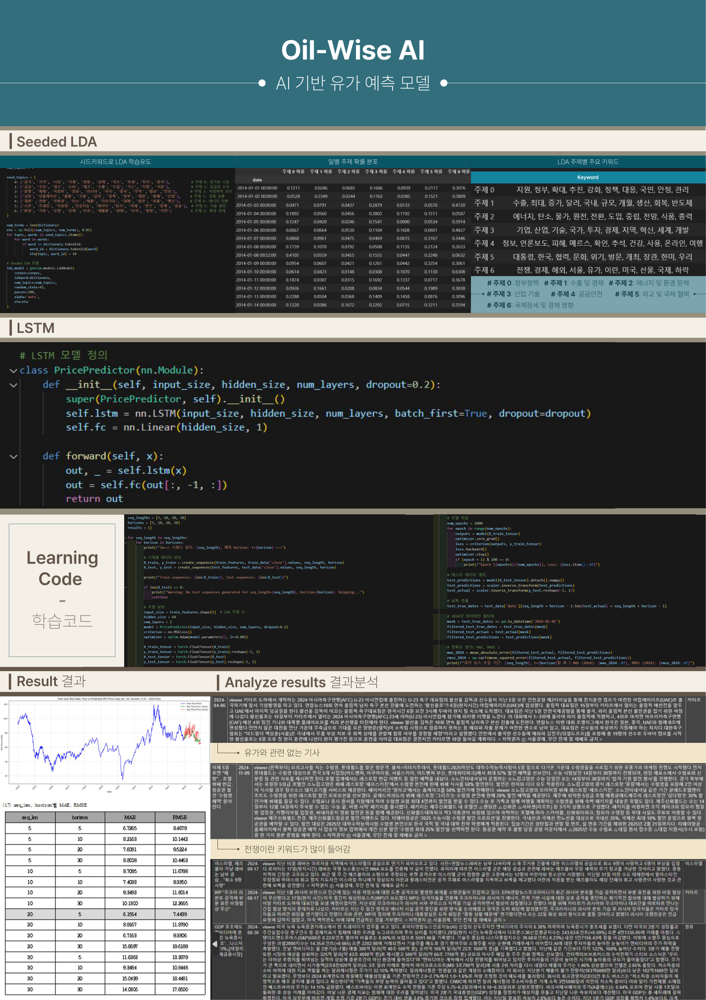
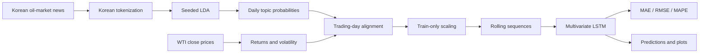

# Oil-Wise AI

[](https://github.com/seonho12-54/LSTM-LDA/actions/workflows/ci.yml)
[](https://www.python.org/)
[](https://pytorch.org/)
[](LICENSE)

한국어 원유 시장 뉴스에서 **Seeded LDA**로 일별 주제 확률을 추출하고,
시장 데이터와 결합한 뒤 **다변량 LSTM**으로 미래 WTI 종가를 예측하는
재현 가능한 연구 프로젝트입니다.

이 저장소는 포스터에 기록된 탐색 실험을 노트북의 숨은 상태에 의존하지 않는
Python 패키지, CLI, 테스트, 시계열 검증, 결과 아티팩트로 재구성합니다.

> 연구 및 교육용 프로젝트입니다. 결과는 투자 자문이나 실제 매매 신호가
> 아닙니다.

## Project poster

아래 이미지를 클릭하면 원본 PDF가 열립니다.

<p align="center">
  <a href="docs/oil-wise-poster.pdf">
    
  </a>
</p>

- [포스터 원본 PDF](docs/oil-wise-poster.pdf)
- [포스터 설명과 재현성 주의사항](docs/POSTER.md)

## What this project solves

유가는 수급, 지정학, 정부 정책, 산업 기술, 환경 이슈가 동시에 반영되는
시계열입니다. 가격 이력만 사용하는 모델은 뉴스가 전달하는 비정형 정보를
직접 활용하지 못합니다. Oil-Wise AI는 이 간극을 다음 두 단계로 연결합니다.

1. 시드 단어로 유도한 LDA가 한국어 뉴스 문서를 7차원 주제 확률로 변환합니다.
2. LSTM이 과거 WTI 가격, 수익률, 변동성, 뉴스 주제 확률 시퀀스를 함께 보고
   지정된 거래일 뒤의 종가를 회귀 예측합니다.

## Architecture



시계열 순서를 보존하며, scaler는 학습 구간에만 적합합니다. 테스트 시점의
뉴스나 가격이 학습 특징에 섞이지 않도록 target date를 기준으로 분할합니다.

## Seeded LDA topics

포스터에서 학습된 키워드를 사람이 검토해 다음 7개 의미 범주로 정리했습니다.
실제 학습 결과의 topic 번호와 의미는 데이터 및 seed 설정에 따라 달라질 수
있으므로 `topic_keywords.json`도 함께 확인해야 합니다.

| Topic | Semantic label | Example signals |
|---:|---|---|
| 0 | 정부 정책 | 지원, 정부, 정책, 대응, 안정 |
| 1 | 수출 및 경제 | 수출, 증가, 달러, 생산, 회복 |
| 2 | 에너지 및 환경 | 에너지, 탄소, 원전, 전환, 중립 |
| 3 | 산업 기술 | 기업, 산업, 기술, 투자, 혁신 |
| 4 | 공공 안전 | 정보, 피해, 건강, 안전, 온라인 |
| 5 | 외교 및 국제 협력 | 대통령, 협력, 위기, 한미, 외교 |
| 6 | 국제 정세 및 경제 영향 | 전쟁, 해외, 유가, 국제, 하락 |

기본 seed 사전은 [`src/oil_wise/config.py`](src/oil_wise/config.py)에 있으며,
각 seed 단어의 topic-word prior를 높인 `eta` 행렬은
[`src/oil_wise/topic_model.py`](src/oil_wise/topic_model.py)에서 생성합니다.

## Poster experiment

포스터는 입력 시퀀스 길이와 예측 horizon을 각각 `5, 10, 20, 30` 거래일로
바꾸어 총 16개 조합을 MAE와 RMSE로 비교합니다.

| Best poster setting | Value |
|---|---:|
| Sequence length | 20 trading days |
| Forecast horizon | 5 trading days |
| MAE | 6.1554 |
| RMSE | 7.4439 |

이 수치는 포스터에 기록된 원 실험 결과입니다. 저장소의 CLI는 같은 grid를
재실행할 수 있지만, 데이터 버전·기사 수집 범위·전처리·라이브러리 버전·seed가
달라지면 값도 달라질 수 있습니다.

## Repository structure

```text
LSTM-LDA/
├─ src/oil_wise/
│  ├─ cli.py              # demo, topics, train, grid commands
│  ├─ config.py           # 7 topic seeds and experiment defaults
│  ├─ data.py             # news/WTI schema validation and alignment
│  ├─ preprocessing.py    # Kiwi or regex Korean tokenizer
│  ├─ topic_model.py      # Seeded LDA eta prior and topic inference
│  ├─ sequences.py        # leakage-safe scaling and rolling windows
│  ├─ model.py            # PyTorch PricePredictor LSTM
│  ├─ training.py         # deterministic training and early stopping
│  ├─ experiments.py      # sequence × horizon grid
│  └─ visualization.py    # headless artifact plots
├─ tests/                 # unit and optional ML integration tests
├─ docs/                  # poster and data contract
├─ notebooks/legacy/      # exact supplied legacy notebook
├─ data/raw/              # local raw data; ignored by Git
└─ artifacts/             # generated models/results; ignored by Git
```

## Installation

Python 3.10 이상을 권장합니다.

```bash
git clone https://github.com/seonho12-54/LSTM-LDA.git
cd LSTM-LDA
python -m venv .venv
```

Windows PowerShell:

```powershell
.\.venv\Scripts\Activate.ps1
python -m pip install --upgrade pip
python -m pip install -e ".[all]"
```

macOS/Linux:

```bash
source .venv/bin/activate
python -m pip install --upgrade pip
python -m pip install -e ".[all]"
```

의존성을 나눠 설치할 수도 있습니다.

- `.[topic]`: Gensim + Kiwi 기반 Seeded LDA
- `.[lstm]`: PyTorch LSTM
- `.[dev]`: pytest, coverage, Ruff
- `.[all]`: topic + LSTM 실행에 필요한 전체 ML 의존성

## Quickstart

실제 데이터 없이도 동일한 스키마의 합성 데이터로 전체 흐름을 확인할 수
있습니다.

### 1. Generate demo data

```bash
oil-wise demo --output data/demo --days 800 --seed 42
```

생성 파일:

- `data/demo/wti_prices.csv`
- `data/demo/oil_news.csv`

### 2. Train Seeded LDA

```bash
oil-wise topics \
  --news data/demo/oil_news.csv \
  --output artifacts/topics \
  --num-topics 7 \
  --passes 30 \
  --iterations 100
```

주요 출력:

- `daily_topic_probabilities.csv`
- `topic_keywords.json`
- `seeded_lda.model`
- `seeded_lda.dictionary`
- `daily_topic_probabilities.png`

### 3. Train one LSTM setting

```bash
oil-wise train \
  --prices data/demo/wti_prices.csv \
  --topics artifacts/topics/daily_topic_probabilities.csv \
  --output artifacts/forecast \
  --sequence-length 20 \
  --horizon 5 \
  --epochs 200
```

주요 출력:

- `price_predictor.pt`
- `feature_scaler.joblib`
- `target_scaler.joblib`
- `metrics.json`
- `predictions.csv`
- `predictions.png`

### 4. Reproduce the experiment grid

```bash
oil-wise grid \
  --prices data/demo/wti_prices.csv \
  --topics artifacts/topics/daily_topic_probabilities.csv \
  --output artifacts/grid \
  --sequence-lengths 5 10 20 30 \
  --horizons 5 10 20 30 \
  --epochs 200
```

`leaderboard.csv`, `best_setting.json`, `rmse_heatmap.png`이 생성됩니다.

## Input data contracts

원본 데이터는 저작권과 배포 권한 문제로 저장소에 포함하지 않습니다.
CSV의 column 이름은 영문 또는 코드에 정의된 한국어 후보 이름을 사용할 수
있습니다.

### WTI prices

| Column | Required | Description |
|---|---:|---|
| `date` | Yes | 거래일 또는 파싱 가능한 날짜 |
| `close` | Yes | WTI 종가; 쉼표와 `$` 기호 허용 |

### Korean news

| Column | Required | Description |
|---|---:|---|
| `date` | Yes | 기사 게시 시각 |
| `title` | One of title/body | 기사 제목 |
| `content` | One of title/body | 기사 본문 |

자세한 검증 규칙은 [data contract](docs/DATA_CONTRACT.md)를 참고하세요.

## Model and validation details

- Architecture: stacked many-to-one `nn.LSTM` + dropout + linear head
- Default hidden size: 64
- Default layers: 2
- Optimizer: Adam
- Loss: MSE
- Stability: gradient norm clipping at 1.0
- Validation: training sequence의 마지막 10%
- Early stopping: validation loss 기준
- Test policy: 최종 holdout은 모델 선택에 사용하지 않음
- Metrics: MAE, RMSE, MAPE, directional accuracy
- Reproducibility: Python, NumPy, PyTorch seed 고정

## Tests and quality checks

기본 테스트:

```bash
python -m pip install -e ".[dev]"
python -m pytest
python -m ruff check .
python -m compileall -q src
```

PyTorch와 Gensim/Kiwi를 설치하면 선택형 통합 경로도 실행할 수 있습니다.
GitHub Actions는 push와 pull request마다 기본 테스트, 린트, 패키지 build를
검증합니다.

## Legacy notebook

사용자가 제공한 원본
[`Untitled23_2025fix_v3.ipynb`](notebooks/legacy/Untitled23_2025fix_v3.ipynb)은
변경하지 않고 보존했습니다. 이 파일은 방문객 SARIMAX/Prophet 분석이며
Oil-Wise 포스터의 Seeded LDA + LSTM 실험과는 별개입니다. 원본의 한글 주석
일부는 인코딩이 깨져 있고 로컬 데이터 파일에 의존하므로 패키지나 CI에서는
실행하지 않습니다. 자세한 내용과 hash는
[`notebooks/README.md`](notebooks/README.md)에 있습니다.

## Limitations

- 뉴스 수집 편향과 중복 기사는 topic probability를 왜곡할 수 있습니다.
- Topic 번호는 의미가 고정된 label이 아니므로 학습 후 keyword 검토가 필요합니다.
- 유가 급변 구간은 과거 패턴과 뉴스 주제만으로 설명되지 않을 수 있습니다.
- 합성 demo 데이터의 성능은 실제 시장 성능을 의미하지 않습니다.
- 실제 배포 전 rolling backtest, 거래 비용, 데이터 지연, model drift 검증이
  추가로 필요합니다.

## License

Source code is available under the [MIT License](LICENSE). News articles,
market data, poster content, and other third-party materials may have separate
rights and usage restrictions.
